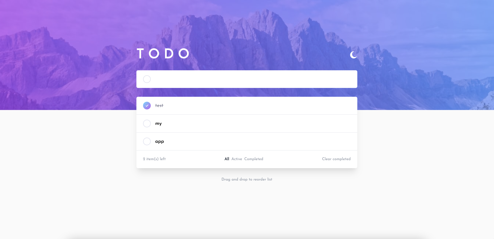
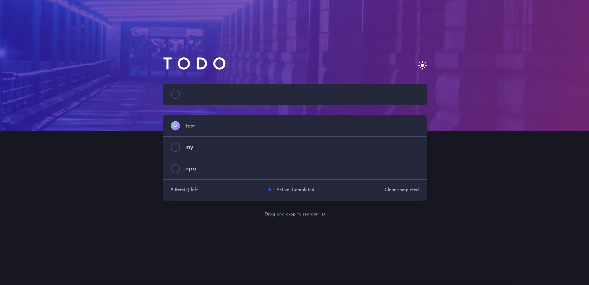

# Simple to-do app

This is a solution to the [Todo app challenge on Frontend Mentor](https://www.frontendmentor.io/challenges/todo-app-Su1_KokOW) d

## Table of contents

- [Overview](#overview)
  - [The challenge](#the-challenge)
  - [Links](#links)
- [My process](#my-process)
  - [Built with](#built-with)
  - [What I learned](#what-i-learned)
  - [Continued development](#continued-development)
  - [Useful resources](#useful-resources)
- [Screenshots](#screenshots)

## Overview

### The challenge

(provided by Frontend Mentor, along with jpg screenshots of how the app should look)

Users should be able to:

- View the optimal layout for the app depending on their device's screen size
- See hover states for all interactive elements on the page
- Add new todos to the list
- Mark todos as complete
- Delete todos from the list
- Filter by all/active/complete todos
- Clear all completed todos
- Toggle light and dark mode
- **Bonus**: Drag and drop to reorder items on the list

### Links

- [Live site](https://todo-app-two-ruddy.vercel.app/)
- [Challenge page (Frontend Mentor)](https://www.frontendmentor.io/challenges/todo-app-Su1_KokOW)

## My process

I started by separating the images into components and thinking how they will interlink. I thought as well about how I was going to manage the global state and decided that this would be a good time to use Context. I decided to use tailwind again, since I am much faster at styling with it.
Then I coded the basic components without functionality but with basic styles, then added functionality. It was quite interesting to play around with the draggable items in the list. Lastly I added responsiveness and dark mode.

### Built with

- [React](https://reactjs.org/) - JS library
- [Tailwind CSS](https://tailwindcss.com/) - CSS framework

**Note: These are just examples. Delete this note and replace the list above with your own choices**

### What I learned

- Practised executing a project from a given set of requirements and design screenshots
- Learned how to create my own drag and drop list component
- Practised using React Context
- Learned how to implement a dark mode
- Practised responsive styling

### Continued development

I'm getting better at responsiveness but it's still something I need to practice. I also noticed I am getting very quick at using Tailwind, so much so that I don't need to use stylesheets or styled components anymore. I really love Tailwind.
This was a fun little project that I completed in a couple of days, I'll definitely use Frontend Mentor more often. It's fun to make up my own projects and design them from scratch, but it's also quite freeing to be able to just start coding based on given requirements and design.

### Useful resources

- [Drag and drop list without dependencies](https://medium.com/free-code-camp/how-to-make-and-test-your-own-react-drag-and-drop-list-with-0-dependencies-6fb461603780) - This article helped me create my own drag and drop list component

### Screenshots

